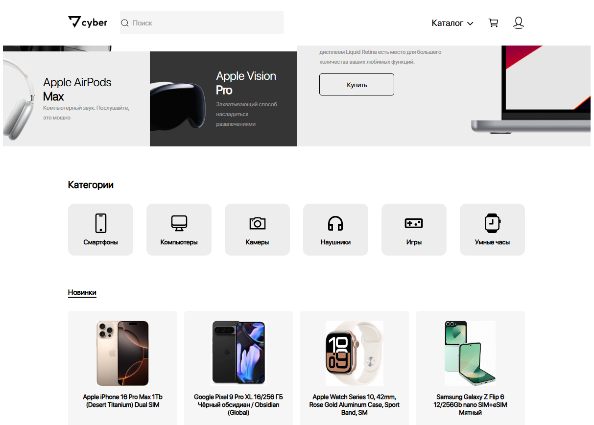
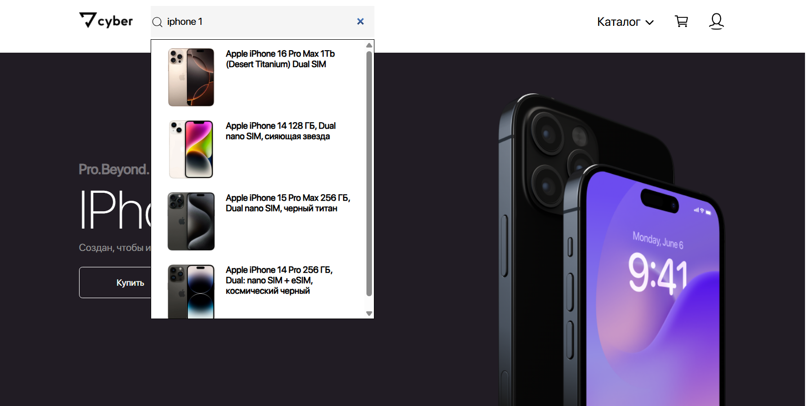
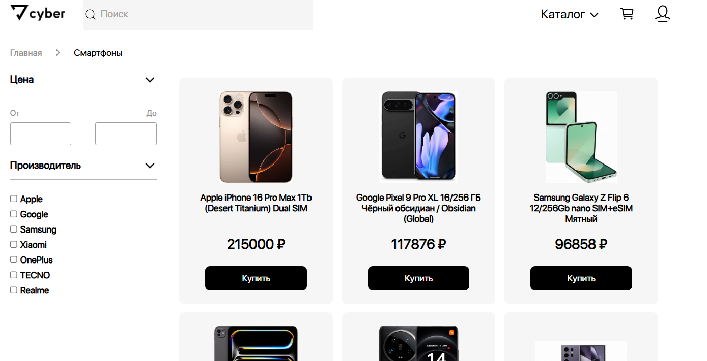
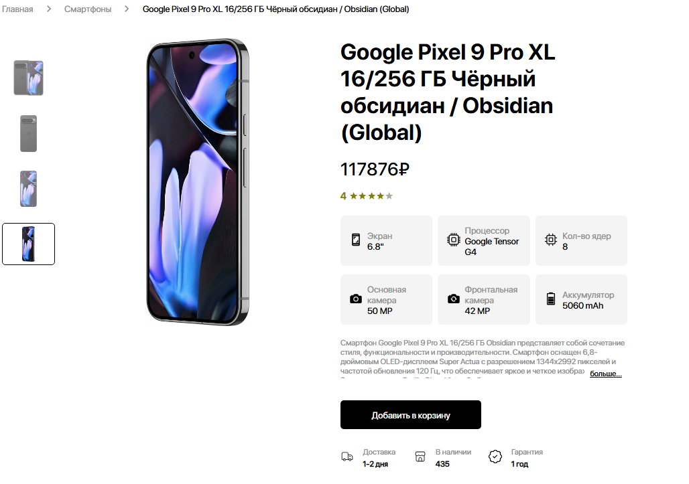
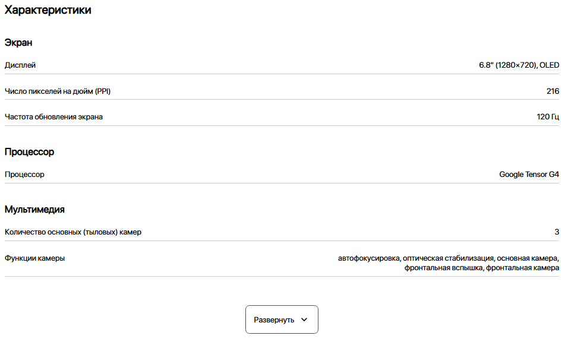
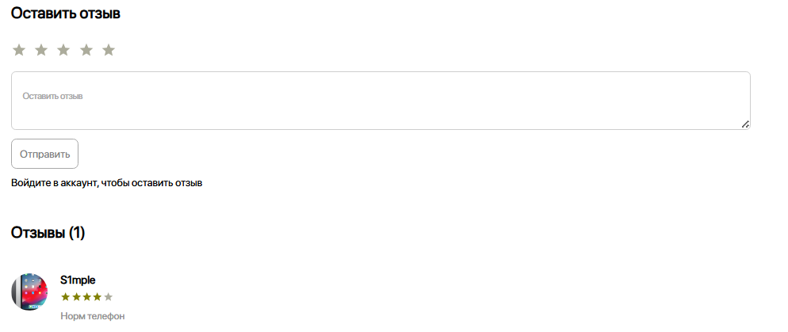
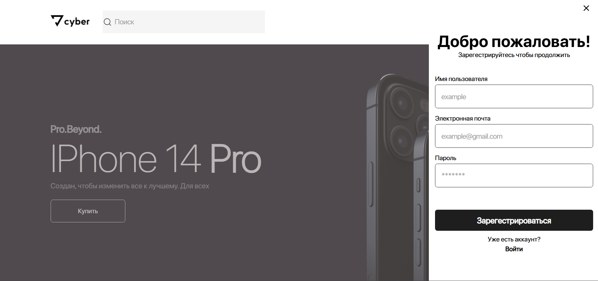
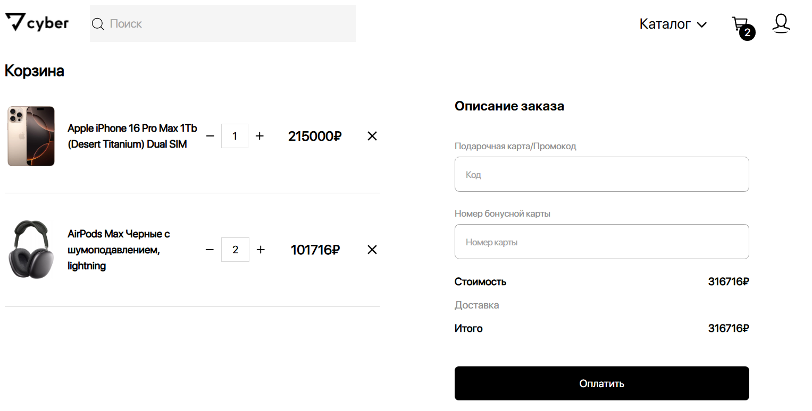

# CyberShop

## О проекте

Этот репозиторий содержит фронтенд часть интернет-магазина электроники, разработанного на React. Проект связан с [бэкенд репозиторием](https://github.com/ZIRex03/CyberShop-backend), где реализована серверная часть и API.

**Важно**: Приложение использует локальную базу данных для разработки. В демонстрационной версии интерактивные функции (регистрация, отзывы, работа с корзиной) недоступны. Все возможности показаны на скриншотах ниже.

## Основные функции

1. **Главная страница**

    * Просмотр категорий товаров
    * Рекомендуемые товары
    * Поиск товаров по названию

2. **Страница категории**

    * Список товаров выбранной категории
    * Фильтрация и сортировка

3. **Страница товара**

    * Подробные характеристики
    * Галерея изображений
    * Просмотр отзывов

4. **Система отзывов**

    * Просмотр оценок и комментариев
    * Форма для добавления отзыва

5. **Профиль пользователя**

    * Форма регистрации/авторизации
    * Возможность добавить аватар

6. **Корзина**

    * Добавление/удаление товаров
    * Оформление заказа (демо)

## Технологии

* **Frontend:** React, Redux Toolkit, React Router
* **Стили:** SCSS
* **API:** Axios

## Скриншоты интерфейса

1. **Главная страница**

2. **Страница категории**

3. **Страница товара**

4. **Профиль пользователя**

5. **Корзина**

